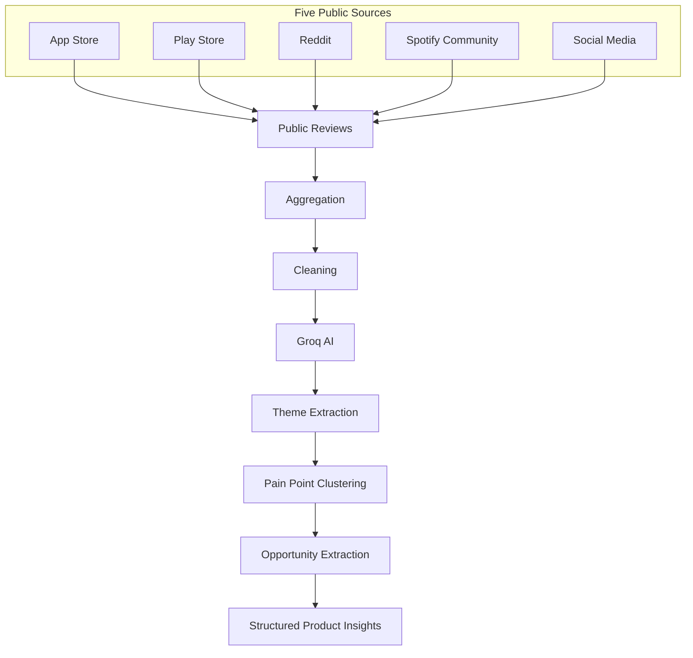
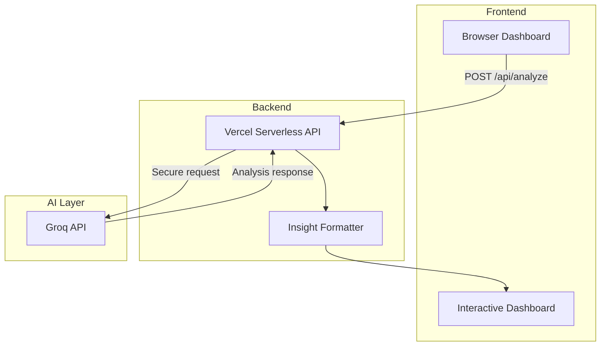
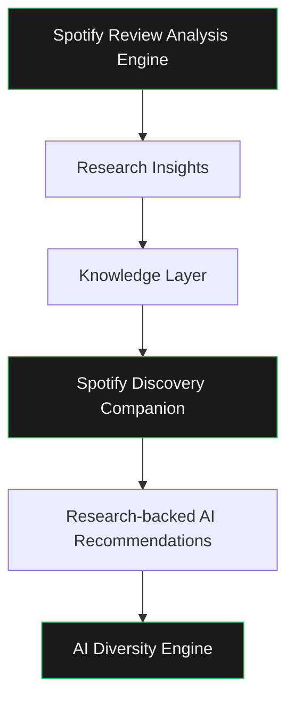

# Spotify Review Analysis Engine

**Turn 700+ public reviews into research-backed product intelligence.**

> Part 1 of an AI Product Management graduation project — the Research Intelligence Layer behind the [Spotify Discovery Companion](https://github.com/Rukhsar24081998/spotify-discovery-companion).

[](https://spotify-review-engine.vercel.app)
[](https://github.com/Rukhsar24081998/spotify-review-engine)
[](LICENSE)


---

The **Spotify Review Analysis Engine** aggregates public user feedback from five platforms, applies Groq AI synthesis, and converts unstructured reviews into structured product insights across six research questions. It is not a consumer music app — it is the upstream research system whose findings were transformed into the Spotify Discovery Companion, a mood-aware music discovery MVP.

| Resource | Link |
|---|---|
| **Live Demo** | [spotify-review-engine.vercel.app](https://spotify-review-engine.vercel.app) |
| **GitHub Repository** | [github.com/Rukhsar24081998/spotify-review-engine](https://github.com/Rukhsar24081998/spotify-review-engine) |
| **Downstream MVP** | [github.com/Rukhsar24081998/spotify-discovery-companion](https://github.com/Rukhsar24081998/spotify-discovery-companion) |

---

## Problem Statement

### Why manual review analysis breaks down

Spotify users express discovery frustrations across App Store ratings, Play Store reviews, Reddit threads, community forums, and social posts. A product researcher reading this feedback manually faces three structural problems:

| Challenge | Impact |
|---|---|
| **Scale** | 700+ reviews across five sources cannot be read thoroughly in a single sprint |
| **Subjectivity** | Analysts overweight recent, emotional, or memorable posts |
| **Synthesis difficulty** | Cross-source patterns — shuffle failure on Play Store, mood gaps on forums, TikTok comparisons on social — stay invisible without aggregation |

The result is slow product discovery, inconsistent themes, and insights that are hard to defend in front of stakeholders or judges.

### Why AI-powered review analysis changes the equation

LLM-assisted synthesis compresses qualitative research from days to minutes while preserving structure and repeatability:

| Manual research | AI-assisted research |
|---|---|
| Sequential reading per source | Parallel aggregation across 5 channels |
| Theme selection varies by analyst | Consistent clustering across 700+ reviews |
| Evidence scattered in notes | Source-tagged samples in every run |
| Static snapshot | Re-runnable as new reviews appear |
| Insights locked in documents | Output mapped to defined research questions |

This engine demonstrates AI-native product research: machines handle scale and pattern detection; humans define questions, validate findings, and decide what to build.

---

## Research Goal

Every analysis run answers six product research questions that anchor the broader discovery project.

| # | Research Question | Research Intent |
|---|---|---|
| **Q1** | Why do users struggle to discover new music? | Identify root causes of discovery failure |
| **Q2** | What are the most common frustrations with recommendations? | Map recommendation system pain points |
| **Q3** | What listening behaviors are users trying to achieve? | Understand intent behind listening sessions |
| **Q4** | What causes users to repeatedly listen to the same content? | Explain repetition loops and comfort-zone behavior |
| **Q5** | Which user segments experience different discovery challenges? | Segment free, premium, and power listeners |
| **Q6** | What unmet needs emerge consistently across reviews? | Surface cross-source opportunity areas |

---

## Data Sources

Five public channels capture discovery pain across platforms, devices, and user contexts.

| Source | What it captures | Collection approach |
|---|---|---|
| **Apple App Store** | iOS sentiment, algorithm complaints, competitive discovery | Live fetch via iTunes RSS API |
| **Google Play Store** | Android-scale patterns — shuffle, ads, Smart Shuffle | 500-review curated corpus |
| **Reddit** | Unfiltered r/spotify discussion on loops and stagnation | Live fetch via Reddit JSON API |
| **Spotify Community** | Feature requests, trust issues, mood/context gaps | Curated forum posts |
| **Social Media** | Real-time sentiment, TikTok/Instagram comparisons | Curated Twitter/X samples |

**More than 700 public reviews** are aggregated per analysis session. A representative sample is sent for AI synthesis; the full corpus count is reported in the dashboard summary bar.

---

## AI Review Analysis Workflow



| Stage | Output |
|---|---|
| **Aggregation** | Unified review pool with source metadata |
| **Cleaning** | Length filtering, normalization, token-aware sampling |
| **Groq AI** | Multi-question qualitative synthesis |
| **Theme extraction** | Recurring topics — stagnation, shuffle, mood blindness |
| **Pain point clustering** | Frustrations grouped by segment and behavior |
| **Opportunity extraction** | Unmet needs translated to product directions |
| **Structured insights** | Six research answers rendered as dashboard cards |

An equivalent **n8n workflow** (`Spotify Discovery Review Engine`) orchestrates the same pipeline for webhook-triggered batch runs during early research phases.

---

## System Architecture



| Layer | Component | Role |
|---|---|---|
| **Browser Dashboard** | `index.html` | Review collection UI, progress states, results cards |
| **Vercel Serverless API** | `api/analyze.js` | Secure Groq proxy — credentials never exposed to client |
| **Groq API** | `llama-3.3-70b-versatile` | Theme-level synthesis across six questions |
| **Insight Formatter** | Client-side parser | Splits AI output into Q1–Q6 question cards |
| **Interactive Dashboard** | Results + summary bar | Reviews count, sources, model, execution time |

---

## How the AI Works

High-level behavior — no implementation or prompt details.

### Review aggregation

On each run, live App Store and Reddit data merge with embedded Play Store, Community, and Social Media corpora into a 700+ review pool. Every review carries a source tag for traceability.

### Multi-source analysis

The system analyzes feedback from five channels in a single pass, surfacing patterns that only appear when iOS, Android, forum, and social voices are read together.

### Theme extraction

Groq identifies recurring themes — algorithm stagnation, broken shuffle, mood-unaware recommendations, and trust deficits — rather than summarizing individual reviews.

### Pain point clustering

Frustrations are grouped by user behavior and segment: free-tier control limits, premium Smart Shuffle interference, explorer fatigue, and repetition loops.

### Opportunity identification

Clustered pain points translate into product opportunity areas: context-aware playlisting, recommendation transparency, social discovery, and artist diversity.

### Structured insight generation

The dashboard renders six answer cards aligned to the research questions, plus a summary bar with reviews analyzed, source count, AI model, and execution time.

---

## Research Findings

Synthesis across 700+ reviews produced six major findings that directly shaped the Spotify Discovery Companion.

| Finding | What users said | Discovery Companion response |
|---|---|---|
| **Recommendation fatigue** | Same artists and tracks recycled weekly; Discover Weekly feels stale | **Artist DNA** — explore sonic universes beyond familiar catalogs |
| **Weak personalization** | Recommendations ignore current mood, activity, and context | **For This Moment** — mood + activity tiles → instant contextual playlists |
| **Poor discovery** | Users find more new music on TikTok than Spotify in a month | **Context DJ** — place, time, and vibe-based discovery sessions |
| **Limited transparency** | No explanation for why a song was recommended; trust erodes | **AI Explanation** — Groq-generated "why this track" rationale |
| **Need for hidden gems** | Algorithm pushes popular and sponsored artists; small artists buried | **AI Diversity Engine** — surfaces lesser-known artists via Artist DNA graph |
| **Need for greater user control** | Shuffle broken, queue hijacked, no dislike for genres | **Mood Bridge** — user-directed emotional journeys with intentional transitions |

### Cross-finding pattern

Users do not lack music — they lack **context, control, and confidence** to try something new. The Discovery Companion was designed around those three gaps, not around adding another recommendation feed.

---

## Relationship to Spotify Discovery Companion

This repository is **Part 1** of a four-part AI Product Management graduation project. It produces evidence; the Companion produces the product.



| Stage | Repository | What it delivers |
|---|---|---|
| Research engine | [spotify-review-engine](https://github.com/Rukhsar24081998/spotify-review-engine) | 700+ review synthesis, six research answers |
| Knowledge layer | Interview transcripts, problem statement, deck | Validated segments, business case |
| Discovery MVP | [spotify-discovery-companion](https://github.com/Rukhsar24081998/spotify-discovery-companion) | Four-tab mood-aware discovery prototype |
| AI recommendations | Groq + Spotify API in Companion | Contextual playlists with human explanations |
| AI diversity engine | Artist DNA + recommendation logic | Hidden gems beyond mainstream algorithm output |

---

## Screenshots

### Homepage

Research questions, five source tags, and one-click analysis entry point.


> Placeholder: add `docs/screenshots/homepage.png`

### AI Analysis

Per-source collection progress and AI thematic analysis phase.


> Placeholder: add `docs/screenshots/analysis.png`

### Results

Summary bar plus six structured question cards.


> Placeholder: add `docs/screenshots/results.png`

### n8n Workflow

Webhook-triggered research pipeline: fetch → aggregate → Groq → respond.


> Placeholder: add `docs/screenshots/n8n-workflow.png`

---

## Tech Stack

Technologies present in this repository and its deployment only.

| Category | Technologies |
|---|---|
| **Frontend** | HTML5, CSS3, Vanilla JavaScript, Google Fonts (Inter, Space Grotesk) |
| **Backend** | Vercel Serverless Functions (Node.js), `api/analyze.js` |
| **AI** | Groq API — `llama-3.3-70b-versatile` |
| **Automation** | n8n workflow (external — `Spotify Discovery Review Engine`) |
| **Deployment** | Vercel, `vercel.json` routing |
| **Live data APIs** | iTunes RSS (App Store), Reddit public JSON |

No React, no database, no `package.json` dependencies. The [Discovery Companion](https://github.com/Rukhsar24081998/spotify-discovery-companion) uses a separate React + Vite stack.

---

## Folder Structure

```
spotify-review-engine/
├── api/
│   └── analyze.js       # Vercel serverless function — Groq API proxy
├── index.html           # Review analysis dashboard
├── vercel.json          # API route configuration
├── LICENSE              # MIT License
└── README.md
```

---

## Installation

```bash
git clone https://github.com/Rukhsar24081998/spotify-review-engine.git
cd spotify-review-engine
vercel
```

For local UI preview (API requires Vercel environment variables):

```bash
npx serve .
```

Set `GROQ_API_KEY` in Vercel before running analysis. Live App Store and Reddit collection runs in the browser; AI synthesis runs server-side only.

---

## Environment Variables

| Variable | Required | Where to set | Description |
|---|---|---|---|
| `GROQ_API_KEY` | Yes | Vercel → Settings → Environment Variables | Groq API bearer token for server-side analysis |

The key is read only in `api/analyze.js` and is never exposed to the browser.

---

## Future Improvements

| Direction | Value |
|---|---|
| **Streaming review ingestion** | Continuous corpus updates instead of per-run batch collection |
| **Embeddings** | Semantic similarity search across review history |
| **Trend detection** | Surface emerging themes week-over-week |
| **Competitive benchmarking** | Compare Spotify discovery pain vs. Apple Music, YouTube Music |
| **Semantic clustering** | Vector-based grouping beyond keyword theme extraction |

---

## Learnings

### AI product research

Defining six research questions before running AI produced actionable output. Without structured questions, LLM synthesis drifts into generic summaries.

### Research synthesis

Cross-source aggregation revealed patterns invisible in single-channel reading — Play Store shuffle complaints, forum mood gaps, and social TikTok comparisons only converged at scale.

### LLM-assisted analysis

Groq compressed multi-source qualitative synthesis from days to seconds. The bottleneck shifted from reading to **validating** — which is the right place for human judgment.

### Scalable user research

A static frontend plus serverless AI proxy scales demo and portfolio presentation without infrastructure overhead. Re-runnable analysis supports iterative research cycles.

### Human validation

AI accelerated synthesis but did not replace interviews, problem statements, or feature prioritization. The engine produced evidence; humans decided what to build and why.

---

## License

This project is licensed under the [MIT License](LICENSE).

---

<p align="center">
  <strong>Spotify Review Analysis Engine · Part 1 of the Spotify Discovery Companion</strong><br>
  AI Product Management Graduation Project<br><br>
  <a href="https://spotify-review-engine.vercel.app">Live Demo</a> ·
  <a href="https://github.com/Rukhsar24081998/spotify-review-engine">GitHub</a> ·
  <a href="https://github.com/Rukhsar24081998/spotify-discovery-companion">Discovery Companion</a>
</p>
